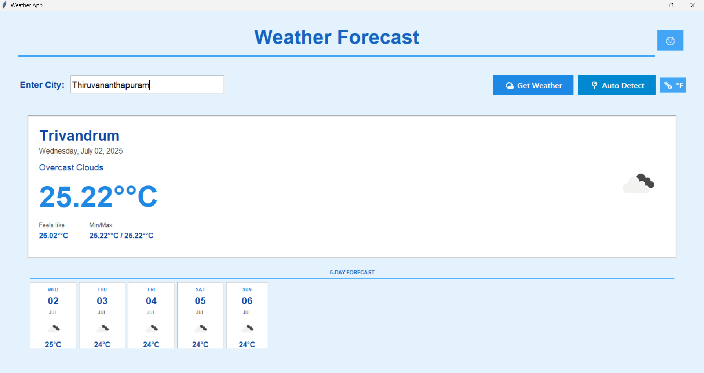

# Weather App

A weather application with both command-line and GUI interfaces. The GUI version includes additional features like 5-day weather forecast.



## Features

### Command Line Version
- Current weather conditions
- Basic weather information
- Simple text interface

### GUI Version
- Current weather display
- 5-day weather forecast
- Visual weather representation
- User-friendly interface
- Theme support (light/dark)
- Unit conversion (Celsius/Fahrenheit)
- Auto location detection

## Requirements

- Python 3.7+
- requests
- python-dotenv
- pillow
- geocoder
- ipgeolocation

## Installation

1. Clone the repository
2. Install required packages:
   ```
   pip install -r requirements.txt
   ```
3. Set up environment variables:
   - Copy `.env.example` to `.env`
   - Get an API key from [OpenWeatherMap](https://openweathermap.org/api)
   - Add your API key to the `.env` file
4. Download weather icons:
   ```
   python download_icons.py
   ```

## Project Structure

```
weather-app/
├── .env.example           
├── .env                   
├── README.md             
├── requirements.txt       
├── main.py               
├── gui_app.py            
├── download_icons.py     
└── icons/                
    ├── 01d.png          
    ├── 01n.png
    └── ...
```

## Usage

### Command Line Version

```
python main.py
```

- Follow the on-screen prompts
- Enter a city name to get current weather
- Type `exit` to quit

### GUI Version

```
python gui_app.py
```

- Enter a city name in the search box or click the GPS icon
- View current weather and 5-day forecast
- Toggle between light/dark theme
- Switch between Celsius/Fahrenheit

## Getting an API Key

1. Go to [OpenWeatherMap](https://openweathermap.org/)
2. Sign up for a free account
3. Go to the [API keys](https://home.openweathermap.org/api_keys) section
4. Copy your API key
5. Paste it in the `.env` file:
   ```
   OPENWEATHER_API_KEY=your_api_key_here
   ```

